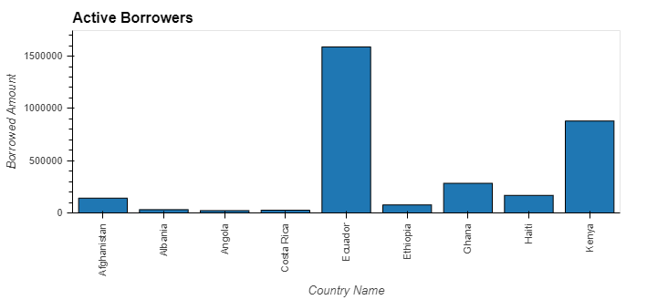
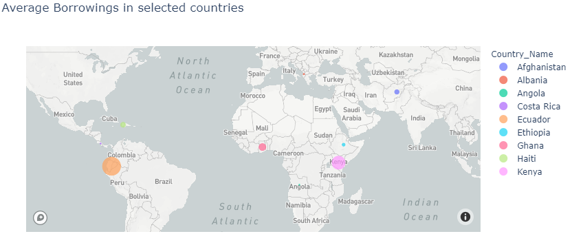
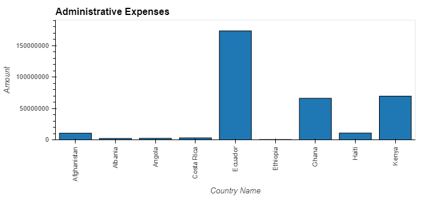
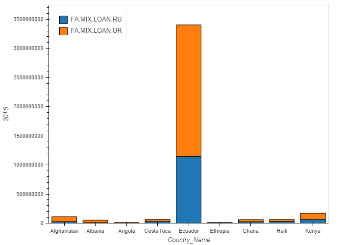

# Project_8
#   Future Markets for PHP as a Microlender

#  What is PHP?

*   A non-profit organization 
*   Has a promising and sustainable global rotating savings plan
*   Provide low cost access to borrowing to marginalized, ”underbanked” communities
*   Allows money flow between rich donors to targeted borrowers

#  What is their requirement?

*   Identify regions that would benefit from PHP’s plans
*   Identify target communities within the region
*   Identify the existing costs of borrowing for the above targeted entities

# Data Challenges

*   Finding the right source(s) of data

*   Identifying data parameters to consume from a huge dataset 

*   Identified Microfinance Information Exchange(MIX) Market data 
    *   Published by the World Bank
    *   A small part of the entire database provided by World Bank
    *   Provides a wealth of information on a variety of different metrics pertinent to microfinance

# Data

##  Primary focus on these data

*   Active Borrowers by Country
    *   Amount borrowed by entities

*   Administrative Borrowing Expenses by Country
    *   Cost of borrowing

*   Comparison of lending trends in both urban and rural communities
    *   Rural or urban target focus

##  Data Source
<https://databank.worldbank.org/home.aspx>

##  Country Set
    *   Afghanistan
    *   Albania
    *   Angola
    *   Costa Rica
    *   Ecuador
    *   Ethiopia
    *   Ghana
    *   Haiti
    *   Kenya

##  Timeframe
    *   2015
    *   2016
    *   2017
    *   2018
    *   2019

##  Data Cleaning

*   Data column names did not match actual data
    *   Renamed them appropriately

*   Columns names were too lengthy or had redundant words
    *   Renamed to concise descriptions

*   Blank columns with no data
    *   Dropped these columns

*   Most of the data was appearing as type object
    *   Converted numeric type data to reflect actual numeric values
    *   Character types were converted to numeric type with 0.0

##  Active Borrowers by Country

*   Angola and Albania had lower borrowing activities
*   Ecuador & Kenya had higher borrowing activities
*   Costa Rica surprisingly had low borrowing activity

           
    
*   PHP can target the following countries
    *   Angola, Albania, Ethiopia & Afghanistan 

##  Administrative Borrowing Expenses by Country
*   Angola and Albania had lower administrative costs
*   Ecuador, Kenya & Ghana had higher administrative costs

    

*   Countries with higher borrowing rate also have higher administrative costs for borrowing
*   PHP can target the following countries and demonstrate how it can lower costs to borrow
    *   Ghana, Kenya, Haiti & Afghanistan

##  Comparison of lending trends in both urban and rural communities
*   The urban population ratio was greater than rural for all countries and years
*   Angola and Albania had no rural population borrower for 2016 onwards

    

*   Angola and Albania had low borrower population for both urban and rural
*   PHP can target the following countries for rural population penetration
    *   Angola, Albania, Ethiopia & Haiti

## Future

*   Angola, Albania & Ethiopia could be the target regions that PHP may prioritize working in these countries

*   Costa Rica is more developed of a country than the rest of the countries selected
    *   One of the lowest number of active borrowers
    *   Signifies that relatively wealthier countries can have large underbanked communities
    *   PHP could focus on Costa Rica as an exception based on further study of related parameters to see why it lags behind in borrowing

*   Administration fees were comparatively higher in Ecuador relative to other countries in the sample pool

*   Perhaps the most noteworthy, even though unsurprising, metric we saw was the difference between numbers of borrowers in rural areas compared to urban areas

